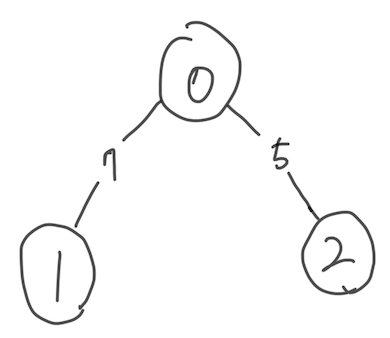
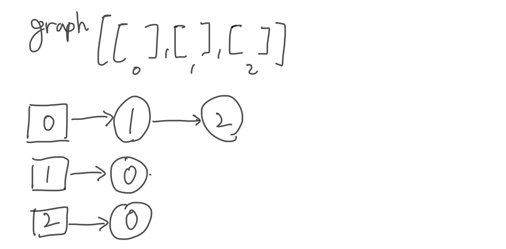

# 이것이 코딩 테스트다 - 5장 DFS/BFS
- 꼭 필요한 자료구조 기초
- 탐색 알고리즘 DFS/BFS
- 음료수 얼려 먹기
- 미로 탈출

## 1. 꼭 필요한 자료구조 기초
- 대표적인 탐색 알고리즘: DFS, BFS
- **그러나 제대로 이해하려면 스택과 큐, 재귀 함수** 이해가 전재된다.
- 자료구조: 데이터를 표현하고 관리하고 처리하기 위한 구조

### 1.1 스택
- First In Last Out
- 파이썬은 리스트를 바로 스택으로 사용해도 된다.

```python
stack = [1, 2, 3]
print(stack) # 최하단 원소부터 출력
print(stack[::-1]) # 최상단 원소부터 출력
```

### 1.2 큐
- First In First Out

```python
from collections import deque

queue = deque()
queue.append(2)
queue.append(3)
queue.append(4)
queue.append(5)

queue.popleft()
queue.pop()

print(queue) # deque([3,4])
```

### 1.3 재귀 함수
- 자기 자신을 다시 호출하는 함수

- **재귀 함수의 종료 조건**: 언제 끝날지, 종료 조건을 **꼭** 명시해야 한다.

- 재귀 함수가 수학의 점화식으로 표현할 때 더 간결해진다. (나중에 DP로 연결됨)

  

## 2. 탐색 알고리즘 DFS/BFS
- DFS
- BFS
- 인접 행렬 방식: 2차원 배열에 각 노드가 연결된 형태 기록하는 방식



|      | 0    | 1    | 2    |
| ---- | ---- | ---- | ---- |
| 0    | 0    | 7    | 5    |
| 1    | 7    | 0    | 무한 |
| 2    | 5    | 무한 | 0    |

- 인접 리스트 방식: 연결된 노드에 대한 정보를 차례대로 연결하여 저장



### 2.1 DFS
- 깊이 우선 탐색, 그래프에서 **깊은 부분을 우선적으로** 탐색하는 알고리즘

- 구체적인 동작 과정

  >1. 탐색 시작 노드를 스택에 삽입하고 방문 처리를 한다.
  >2. 스택의 최상단 노드에 방문하지 않은 인접 노드가 있으면 그 인접 노드를 스택에 넣고 방문 처리를 한다. 방문하지 않은 인접 노드가 없으면 스택에서 최상단 노드를 꺼낸다.
  >3. 2번의 과정을 더 이상 수행할 수 없을 때까지 반복한다.


### 2.2 BFS

- 너비 우선 탐색, **가까운 노드부터 탐색하는 알고리즘**

- 구체적인 동작 과정

  > 1. 탐색 시작 노드를 큐에 삽입하고 방문 처리를 한다.
  > 2. 큐에서 노드를 꺼내 해당 노드의 인접 노드 중에서 방문하지 않은 노드를 모두 큐에 삽입하고 방문 처리를 한다.
  > 3. 2번의 과정을 더 이상 수행할 수 없을 때까지 반복한다.

